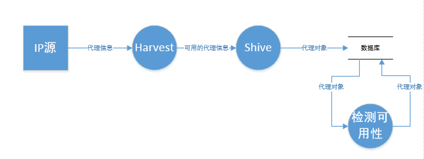

# Eroxy

数据流图:




帮助我建立IP池、不断抓取、时时更新

基于正则表达式解析页面


```python
from Eroxy import ProxyFarmer
from Eroxy import ProxyPatrol


if __name__ == '__main__':
    # 添加一个目标网站
    famer = ProxyFarmer('http://www.xicidaili.com/')
    # 根据页面自己撰写正则表达式, 传入解析IP和port的规则
    famer.rules("\d{1,3}\.\d{1,3}\.\d{1,3}\.\d{1,3}", '(?<=<td>)\d{2,5}(?=</td>)')

    # 存入数据库
    famer2 = ProxyFarmer('another url')
    famer2.rules("ip regex", 'port regex')

    famer.hibernate()
    famer2.hibernate()

    # 检验IP可用性和延迟
    ProxyPatrol.loop()
```

由于松耦合的设计, 抓取IP和port、校验代理可用性、持久化、代理验证方法等都可以替换成新的实现


```python
famer2 = ProxyFarmer('another url')
famer2.rules("ip regex", 'port regex')
# ProxyFarmer使用requests库抓取页面, 所以requests支持的功能, 它也行噢
famer2.headers = ...
famer2.cookies = ...

# IPJudger.py
实现ProxyJudger接口的函数可以作为校验IP用
不过一般来说默认提供的HTTPJudger已经够用了

# proxy: 传入代理IP和端口, 如 62.219.95.13:8080
# timeout:超时时间   https:默认False时使用http协议,否则使用https协议
# verify:verify为空时,默认检测IP的网站为httpbin.org/ip. verify可以接受一个网址来覆盖IPJudger的默认行为
# 需要注意的是，网址前不要带协议(直接使用如'www.google.com'形式。)
def HTTPJudger(proxy, timeout=10, https=False, verify=None)
```


结果如下:

| IP              | Port  | delay | inTime     | alive |
| --------------- | ----- | ----- | ---------- | ----- |
| 1.162.51.252    | 8080  | 2556  | 2016-08-16 | 1     |
| 1.2.149.129     | 8080  | 2270  | 2016-08-16 | 1     |
| 101.201.235.141 | 8000  | 4063  | 2016-08-16 | 1     |
| 101.66.253.22   | 8080  | 3868  | 2016-08-16 | 1     |
| 108.59.10.129   | 55555 | 627   | 2016-08-16 | 1     |
| 113.80.200.244  | 8118  | 2117  | 2016-08-16 | 1     |
| 118.180.15.152  | 8102  | 437   | 2016-08-16 | 1     |
| 119.188.94.145  | 80    | 759   | 2016-08-16 | 0     |
| 119.253.32.5    | 8080  | 439   | 2016-08-16 | 1     |
| 119.6.136.122   | 80    | 971   | 2016-08-16 | 1     |
| 120.25.171.183  | 8080  | 8389  | 2016-08-16 | 1     |
| 121.19.114.245  | 8118  | 1889  | 2016-08-16 | 1     |
| 121.193.143.249 | 80    | 572   | 2016-08-16 | 1     |
| 123.56.28.196   | 8888  | 1274  | 2016-08-16 | 1     |
| 123.57.190.51   | 7777  | 856   | 2016-08-16 | 1     |
| 124.88.67.9     | 80    | 803   | 2016-08-16 | 1     |
| 125.212.217.215 | 80    | 1095  | 2016-08-16 | 1     |
| 171.40.92.127   | 9999  | 4577  | 2016-08-16 | 1     |
| 198.11.173.39   | 80    | 8887  | 2016-08-16 | 1     |
| 202.100.167.145 | 80    | 2015  | 2016-08-16 | 1     |
| 202.100.167.149 | 80    | 4108  | 2016-08-16 | 1     |
| 202.100.167.160 | 80    | 1023  | 2016-08-16 | 1     |
| 202.100.167.180 | 80    | 1020  | 2016-08-16 | 1     |
| 222.33.192.238  | 8118  | 2630  | 2016-08-16 | 1     |
| 52.209.175.205  | 8080  | 4400  | 2016-08-16 | 0     |
| 58.247.125.205  | 80    | 3311  | 2016-08-16 | 1     |
| 58.251.152.233  | 80    | 1030  | 2016-08-16 | 1     |
| 59.39.88.190    | 8080  | 7095  | 2016-08-16 | 1     |
| 85.29.155.118   | 8080  | 1507  | 2016-08-16 | 1     |
| 88.157.149.250  | 8080  | 1002  | 2016-08-16 | 1     |